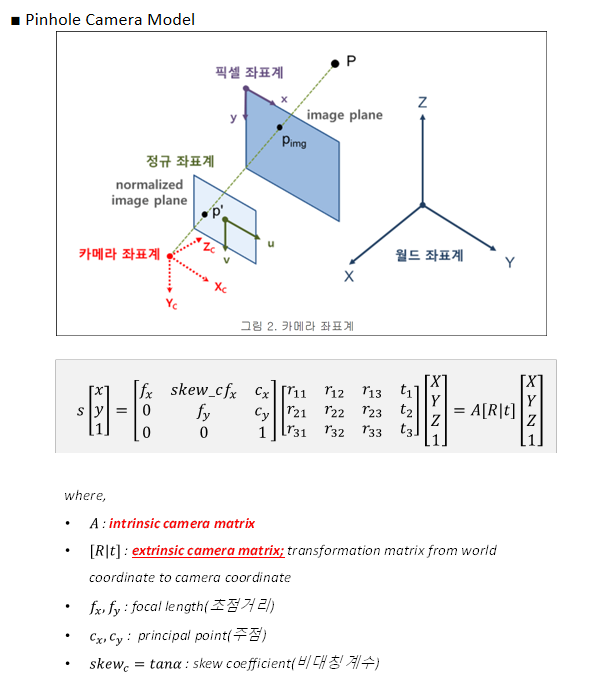

## Camera Calibration

- 목적
    - 카메라 파라미터 값을 구하는 과정
    - 3차원 현실 ↔ 이미지 투영 위치에서 영향을 끼치는 모든 요인들의 값을 구하는 것
    - Intrinsic parmeter / extrinsic parmeter 가 있음
        - Intrinsic
            - focal length
            - principal point
            - radial distortion coefficients of the lens
        - Extrinsic
            - 이미지 생성 당시 카메라 위치 및 방향 기하학적 공간 요소를 의미 ( Translation , Rotation )

■ Pinhole Camera Model

■ Calibrate Camera method

■ Camera 왜곡

- 일반적으로 렌즈 왜곡의 수학적 모델은 카메라 내부 파라미터의 영향이 제거된 normalized image plane에서 정의됨

- 렌즈계의 비선형성에 의해 왜곡(주로 radial distorion)이 됨
    - ${(x_{n-u}, y_{n-u})}$ : undistortion
    - ${(x_{n-d}, y_{n-d})}$ : nomalized distortion 좌표계
    - k1, k2, k3 : radial distortion coefficient
    - p1, p2 : tangential distortion coefficient
    - ru : 왜곡이 없을 때의 중심(principal point) 까지의 거리 (반지름)
    
    

    - (xn_d, yn_d)는 normalized image plane에서의 좌표
    - 실제 영상 픽셀 좌표 (xp_d, yp_d)는 카메라 내부 파라미터 반영하여 다음과 같이 구해짐
    
    

    

https://gaussian37.github.io/vision-concept-lens_distortion/

- 코드 참고 : https://searching-fundamental.tistory.com/78

